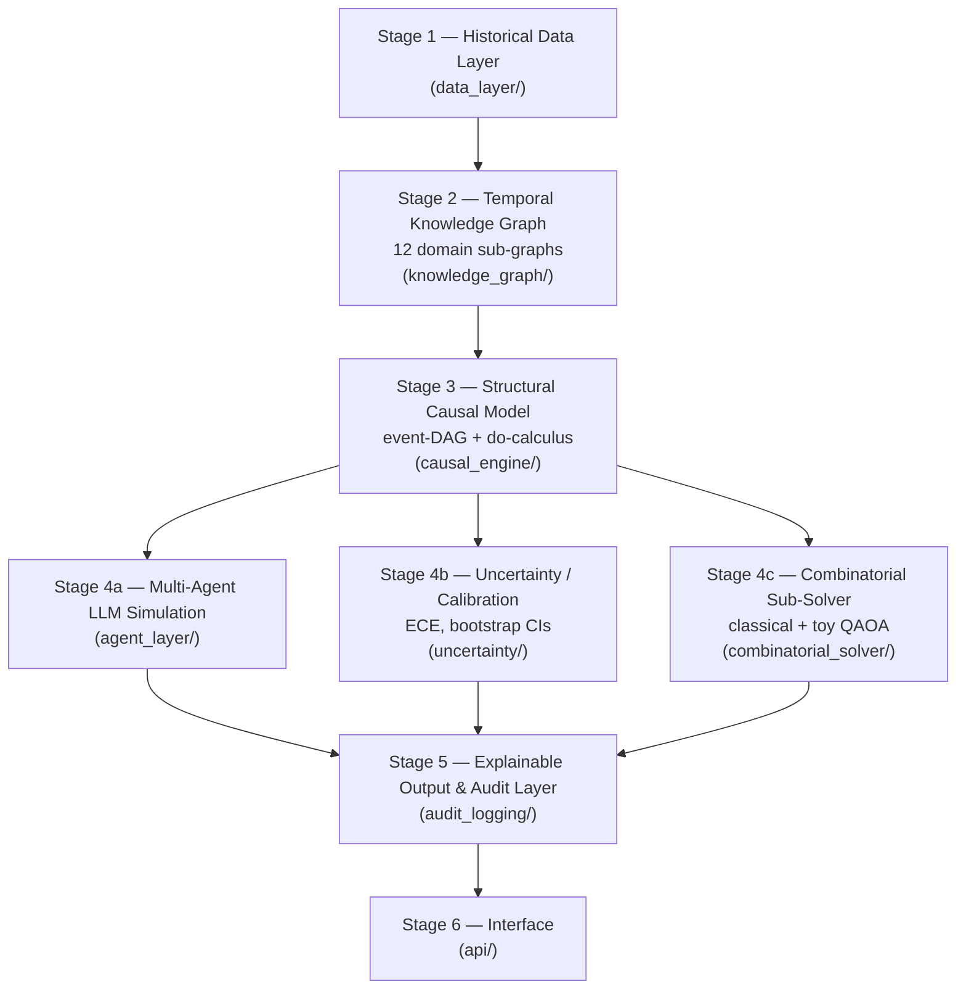

# CHRONOS Prototype

Repository for *"CHRONOS: A Causally-Constrained Architecture for Scientifically Defensible Counterfactual History"* (Mezbah Uddin Rafi, Independent Researcher).

This repository implements the architecture described in the manuscript's Section 7 (CHRONOS). It is **not** a deployable product — it is a research prototype whose purpose is (a) to make the manuscript's algorithms and empirical claims (Tables 2 and 3) fully reproducible, and (b) to define, via typed interfaces, the module boundaries a production implementation would need to fill in.

## Architecture

CHRONOS is organized as six sequential/parallel processing stages. Data flows through Stages 1–3, fans out into three parallel Stage-4 components that read from and write back to the causal layer, and reconverges at Stage 5 before reaching the user-facing Stage 6 (manuscript Section 7.1, Figure 1).



## Repository layout

| Path | Contents |
|---|---|
| `causal_engine/`, `combinatorial_solver/`, `uncertainty/`, `experiments/` | Working code (see status table below). |
| `knowledge_graph/`, `agent_layer/`, `data_layer/`, `api/`, `audit_logging/`, `evaluation/` | Interface scaffolds only (see status table below). |
| [`supplementary/`](supplementary/) | The original standalone scripts (`sim1_scm_propagation.py`, `sim2_qaoa_maxcut.py`) submitted alongside the manuscript, kept unmodified for provenance. |
| [`paper/`](paper/) | The manuscript itself (`CHRONOS_manuscript.docx`) and all manuscript tables as data (`manuscript_tables.xlsx`). |

## Module map (manuscript Table 5)

| Module | Status | Responsibility | Section |
|---|---|---|---|
| `data_layer/` | Interface scaffold | Source connectors, provenance tagging | 7.2 |
| `knowledge_graph/` | Interface scaffold | 12 domain sub-graph schemas; TKGR forecasting + counterfactual-query extension; graph storage | 3.3, 7.2 |
| `causal_engine/` | **Working implementation** | Structural causal model, do-calculus graph surgery, CHRONOS-Propagate Monte Carlo algorithm | 7.3, 7.4, 7.5 |
| `agent_layer/` | Interface scaffold | Goal/belief/memory agent base class; institution templates; RAG grounding against the KG | 7.6 |
| `combinatorial_solver/` | **Working implementation** (classical + toy QAOA) | Classical solver (default); statevector-simulated QAOA/VQE module invoked conditionally | 8 |
| `uncertainty/` | **Working implementation** | ECE calibration, bootstrap confidence intervals | 9 |
| `api/`, `frontend/` | Interface scaffold | Researcher query API; interactive timeline and map UI | 10.2 |
| `audit_logging/` | Interface scaffold | Branch/provenance/contradiction audit trail | 7.7 |
| `evaluation/` | Interface scaffold | Table 4 benchmark suite harness | 9 |
| `experiments/` | **Working implementation** | Reproduces Tables 2, 3, and 6 exactly (fixed random seeds) | 7.5, 8.2, 12.3 |

## Quickstart

```bash
git clone https://github.com/murafi99/chronos-prototype.git
cd chronos-prototype
pip install -r requirements.txt

# Reproduces Table 2 (toy SCM propagation, Monte Carlo do-calculus)
python -m experiments.reproduce_table2_scm

# Reproduces Table 3 (toy QAOA vs. classical MaxCut)
python -m experiments.reproduce_table3_qaoa
```

Both scripts are self-contained (no external data or API keys required, deps are just `numpy` + `scipy`) and run in well under a minute on a laptop CPU.

## Usage examples

**Structural causal model + do-calculus intervention** (`causal_engine/`):

```python
from causal_engine.scm import SCM
from causal_engine.propagate import chronos_propagate, branch_distribution

scm = SCM()
scm.add_node("Trigger", [], lambda pv, u: (u > 0).astype(int),
             noise_sampler=lambda rng, n: rng.random(n) - 0.5)
scm.add_node("Outcome", ["Trigger"],
             lambda pv, u: (u < 0.7 * pv["Trigger"] + 0.2).astype(int),
             noise_sampler=lambda rng, n: rng.random(n))

result = chronos_propagate(scm, do={"Trigger": 1}, n_samples=20000, seed=42)
point, lo, hi = branch_distribution(result.values["Outcome"], n_categories=2)
```

**Classical vs. QAOA MaxCut solver** (`combinatorial_solver/`):

```python
from combinatorial_solver.classical_solver import brute_force_maxcut, hill_climb_maxcut
from combinatorial_solver.qaoa_solver import qaoa_maxcut

n, edges = 6, [(0, 1, 1.2), (1, 2, 0.8), (2, 3, 1.5), (3, 4, 1.0), (4, 5, 0.6)]

best_val, _ = brute_force_maxcut(n, edges)
classical = hill_climb_maxcut(n, edges, n_restarts=200)
qaoa_val, _ = qaoa_maxcut(n, edges, depth=2, n_restarts=8)
```

## Results

**Table 2 — Toy SCM propagation** (synthetic graph, n=20,000 Monte Carlo samples, 95% bootstrap CIs; SYNTHETIC/TOY demonstration, not a real-history claim):

| Condition | P(Escalated Conflict) | P(Negotiated Settlement) | P(Frozen Stalemate) | Contradiction rate |
|---|---|---|---|---|
| Observational (no intervention) | 0.640 [0.633, 0.646] | 0.203 [0.198, 0.208] | 0.157 [0.152, 0.163] | 0.306 |
| do(Trigger=1) | 0.710 [0.704, 0.716] | 0.156 [0.151, 0.161] | 0.134 [0.129, 0.139] | 0.338 |
| do(Trigger=0) | 0.575 [0.568, 0.581] | 0.240 [0.234, 0.246] | 0.186 [0.180, 0.191] | 0.278 |

Average Causal Effect of do(Trigger=1) vs. do(Trigger=0) on P(Escalated Conflict): **0.135**

**Table 3 — Toy MaxCut: classical vs. simulated QAOA** (6 qubits, exact statevector simulation, not real quantum hardware):

| Method | Best cut value | Approximation ratio |
|---|---|---|
| Brute-force exhaustive search (64 states) | 5.770 | 1.000 |
| Classical hill-climbing (200 restarts) | 5.770 | 1.000 |
| QAOA, circuit depth p=1 | 4.321 | 0.749 |
| QAOA, circuit depth p=2 | 4.980 | 0.863 |
| QAOA, circuit depth p=3 | 5.366 | 0.930 |

QAOA approaches but does not beat the classical heuristic at these depths — the empirical basis for the paper's Section 8.3 conclusion (below).

## Design principle

The `combinatorial_solver/` package is deliberately built as a strategy-pattern interface (manuscript Section 10.2): `classical_solver.py` is the default backend, and `qaoa_solver.py` is a conditionally-invoked alternative. A future quantum-hardware backend (real Qiskit/PennyLane/Braket/D-Wave Ocean calls, rather than a local statevector simulation) can be dropped in behind the same function signature without touching any other module — this is the concrete embodiment of the paper's Section 8.3 conclusion that a quantum backend is architecturally ready but not currently advantageous.

## License

MIT — see [LICENSE](LICENSE).

## Citation

If you use this prototype, please cite the accompanying manuscript (see the paper's own reference list for full citation details once finalized).
